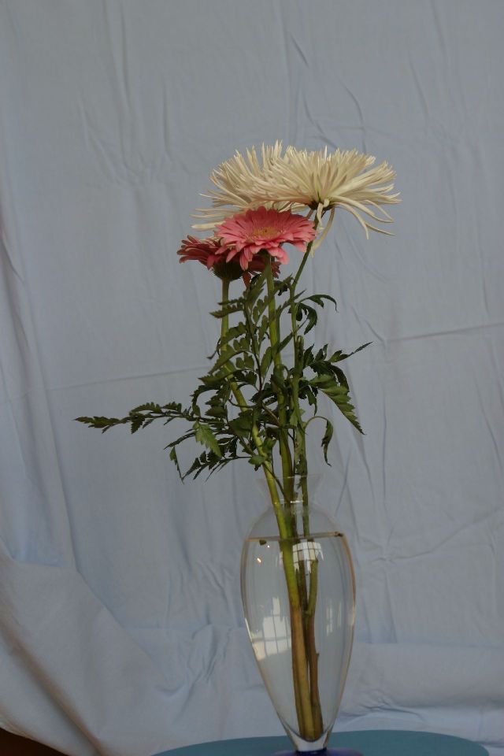

# Image mattiong	
## Performance:





### Usage:
```
python viscomp.py --matting \
                --backA ../test_images/small/flowers-backA.jpg \
                --backB ../test_images/small/flowers-backB.jpg \
                --compA ../test_images/small/flowers-compA.jpg \
                --compB ../test_images/small/flowers-compB.jpg \
                --alphaOut alpha.tif \
                --colOut col.tif
```

               

### Input

+

+

+


### Output


# Image compositing 
### Usage:
```
python viscomp.py --compositing \
	            --alphaIn alpha.tif \
	            --colIn col.tif \
	            --backIn ../test_images/small/window.jpg \
	            --compOut comp.jpg
```
### Input


+

+


### Outout


